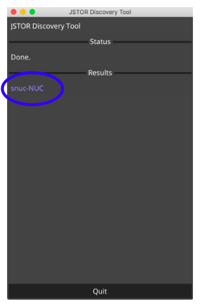

# JSTOR Offline Index

## About the NUC
The device provided is a NUC (Next Unit of Computing) storage device that contains the full index of the JSTOR Archive Journals collection.

## Installation
Installation list

- NUC device
- Copy of installation instructions
- Letter introducing the device and program to the DOC

Upon receipt of the NUC:

*These instructions will work whether you are a) installing the NUC outside the facility to update it or to make thumb drives for use in the prison, or b) installing the NUC within the facility where it will be accessed directly on the Local Area Network (LAN) by students and administrators:*

1. Use the provided cable to plug in and power the device. Turn on the device using  the on/off button on the front of the device.
2. Connect the NUC to the local network using an ethernet cable.
3. Once the device is on and connected, you will need to determine the IP address for the device on the network.  Since the device is designed to be used in “headless mode” -- that is, just plugged into the network without having to log directly into the device and without having to connect a monitor or keyboard -- to get the IP address, follow these steps:
* The JSTOR PEP Device ID Tool is a small application that, when run on a computer in the same network as the NUC, will find it and show its address.  

**Download it here:**

Download for mac [https://ithaka-labs-public.s3.amazonaws.com/pep/tool/PEPDeviceIDTool_darwin](https://ithaka-labs-public.s3.amazonaws.com/pep/tool/PEPDeviceIDTool_darwin)

Download for windows [https://ithaka-labs-public.s3.amazonaws.com/pep/tool/PEPDeviceIDTool_windows.exe](https://ithaka-labs-public.s3.amazonaws.com/pep/tool/PEPDeviceIDTool_windows.exe)

**For Mac computers:** After downloading the JSTOR PEP Device ID Tool to your Mac, make sure your Mac is on the same network as the NUC (if you have multiple options in your location). Then,  open a terminal window and  run the script by typing:   

cd ~/Downloads; chmod +x PEPDeviceIDTool_darwin; ./PEPDeviceIDTool_darwin

For example, if you downloaded the script to your Downloads folder, you would type:
cd ~/Downloads; chmod +x JSTORDiscoveryClient; ./JSTORDiscoveryClient

**For Windows computers:** double-click to run the JSTOR PEP Device ID Tool. The tool will search for the NUC device and if found, will look like this:

Click on the snuc-NUC link in “Results” to open a browser window showing your the NUC JSTOR installation.  The URL in the address window can be used by any computer in the network to use JSTOR on the NUC.  This consists of the device’s IP address, followed by the “:1323” suffix.  

For example, if the IP address you see is 192.168.21.83, students and administrators would enter the following into a browser window to access JSTOR: 

**http://192.168.21.83:1323**
 
### Troubleshooting installation:
* When initially using the JSTOR PEP Device ID Tool, if you see the message "No appliance found" in the status box, please contact us, and we can obtain it for you and further troubleshoot.
* If the launch script doesn't work the first time, try to connect the computer you're using to discover the NUC with an ethernet connections (just like the NUC), since some networks separate out and block discovery tools across wifi and wired connections.
* If you are installing the NUC where it is connected to the Internet, JSTOR has the ability to identify its IP address: contact us once it’s connected to the network and on, and we can get this information for you.
* If you are getting security or permissions errors when running the JSTOR PEP Device ID Tool, please contact us and we will walk you through how to remedy.

## Administration
Use the **Admin Login** link in upper right corner to access student requests and to configure drives.

### About your admin password
The password to login is: **ThoughExactlyAnotherStream**

Admins cannot change a password. JSTOR Labs can change passwords either remotely or if a device is mailed to us.

### Configure drives
A 128G USB drive should be sufficient for this process.

To configure a new drive:

* Use the drive dropdown to choose a device to copy to, then click Select.
* Make selections for which disciplines to include in the drive. You will see an indication of storage required for the device you are configuring.
* On the next page, enter a name for your device, then click Export.

The main Admin page will display the devices you have configured from your NUC drive. 

### Manage student requests
Use the **View Requests** link to see the queue of items students have reqeuested.

Act on a request by selecting print, PDF, or deny. Choose PDF only if you are connected to JSTOR.org and can access the full database.

Once a **pending** item has action taken on it (by clicking either **print**, **pdf** or **deny**), it will become **completed** and be viewable with the completed filter. All items will persist in the list--there is no method for deletion.

You can change the sorted date order of requests by toggling the arrows next to **Requested**. 

##### Sort requests
Use the button to sort by either **Pending** requests, or **Completed** requests.

##### Import a list
If you are acting on student requests on non-networked computers, you may wish to export that list and then import it to your main computer to keep all requests on one device. Connect or transfer the .csv file you exported from the non-networked computer and on your main computer choose **Import.** 

There is currently not a method for editing the csv file data then uploading the changes to the NUC.

##### Export a list
You may wish to use this option if you are working with student requests on a non-networked computer. Request lists you modify on the non-networked computer can be exported to a .csv file and then imported to your main machine. Only the items you are currently viewing will be exported (either the pending list or the completed list). The links contained in the csv file can be used to access JSTOR content on the web.

There is currently not a method for editing the csv file data then uploading the changes to the NUC.

## Introduction letter

Please use this letter to introduce the program and device to any necessary parties. Feel free to make edits to the letter as fits your needs.

[Download the Word doc](https://ithaka-labs.s3.amazonaws.com/static-files/images/pep/Introductory+Letter+for+Department+of+Corrections+Feb+2020.docx)